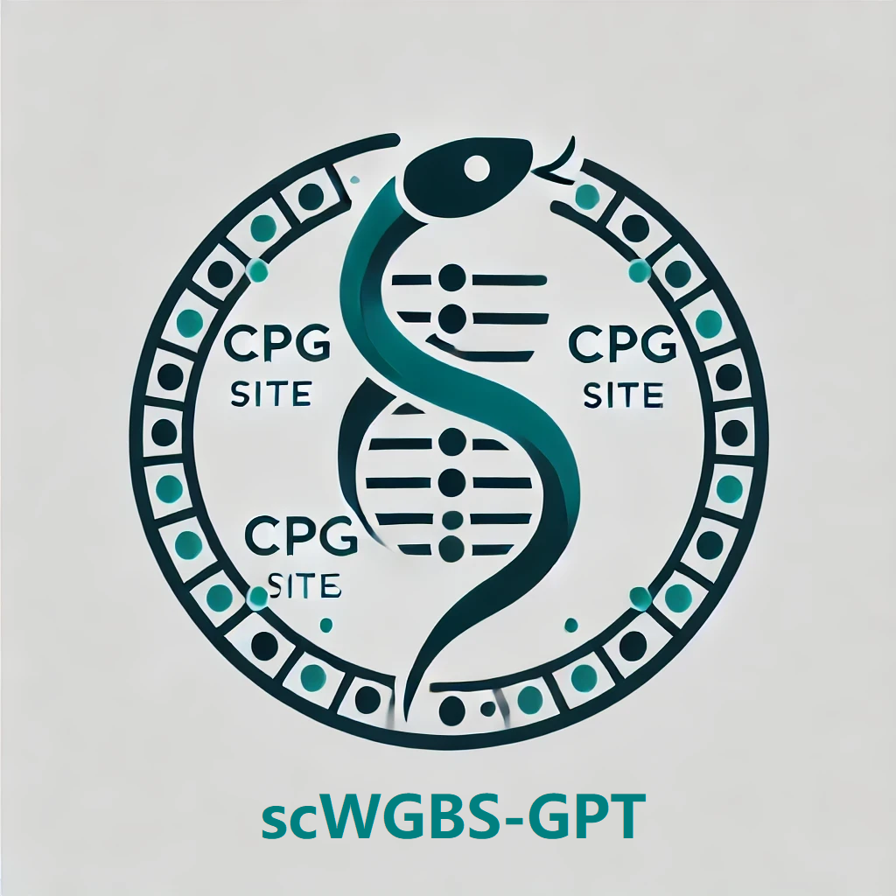

<div align="center" style="margin: 0; padding: 0;">
  <h1 style="margin: 0; padding: 0;">🧬 scDNAm-GPT</h1>
  <p style="margin-top: 0; font-size: 0.95rem; color: #555;">
    (formerly known internally as <code>scWGBS-GPT</code>)
  </p>
  
  <p>
    A Foundation Model for Capturing Long-Range CpG Dependencies in Single-Cell Whole-Genome Bisulfite Sequencing
  </p>
  <p style="max-width: 720px; margin: 0 auto; font-size: 0.95rem; color: #333;">
    We have organized a comprehensive benchmark and updated all the main figures 1, 2, 3, 4, and 5 in this revision.
    The title of the manuscript has been changed, and the model name has been updated from <strong>scWGBS-GPT</strong> to <strong>scDNAm-GPT</strong>.
  </p>
  <p>
    📄 <a href="https://www.biorxiv.org/content/10.1101/2025.02.19.638959v2" target="_blank">
      Read our paper on bioRxiv
    </a>
  </p>
  <div align="center" style="margin: 1.5rem 0;">
    <div style="display: flex; gap: 1.25rem; justify-content: center;">
      <a href="#-key-features" style="text-decoration: none; color: #2d3748; font-weight: 500;">Key Features</a>
      <span style="color: #cbd5e0;">•</span>
      <a href="#-performance" style="text-decoration: none; color: #2d3748; font-weight: 500;">Performance</a>
      <span style="color: #cbd5e0;">•</span>
      <a href="#-quick-start" style="text-decoration: none; color: #2d3748; font-weight: 500;">Quick Start</a>
      <span style="color: #cbd5e0;">•</span>
      <a href="#-faq" style="text-decoration: none; color: #2d3748; font-weight: 500;">FAQ</a>
      <span style="color: #cbd5e0;">•</span>
      <a href="#-license" style="text-decoration: none; color: #2d3748; font-weight: 500;">License</a>
      <span style="color: #cbd5e0;">•</span>
      <a href="#-contributing" style="text-decoration: none; color: #2d3748; font-weight: 500;">Contributing</a>
      <span style="color: #cbd5e0;">•</span>
      <a href="#-citation" style="text-decoration: none; color: #2d3748; font-weight: 500;">Citation</a>
    </div>
  </div>
</div>

## 🌟 Highlights
🧬 **Analyzing Single-Cell Methylation Data** | 🌐 **Whole-Genome-Scale Context Modeling** | 🔬 **Single-CpG Resolution** | ⚡ **Mamba-Powered Speed**

---

## 🔥 Key Features

- **🧬 Analyzing Single-Cell Methylation Data**: The first language model for analyzing single-cell methylation data, offering unparalleled accuracy and scalability.
- **🌐 Whole-Genome-Scale Processing**: Handles sequences with **up to 20 million CpG sites** - 500× longer than conventional methods
- **🔬 Single-CpG Resolution**: Captures methylation patterns at individual CpG level with 96.8% average cell type classification accuracy
- **⚡ Mamba-Powered Efficiency**: Combines selective state space models with cross-attention for **200× faster inference** vs standard transformers
- **🧩 Modular Design**: Easily adaptable for diverse epigenomic analysis tasks including:
  - Cell type annotation
  - Cancer subtyping
  - Developmental trajectory inference
  - Deconvolution cell-free DNA methylation data

## 🏆 Performance
**Human Brain Cell Type Classification**  
Test accuracy on 15 cell types from human prefrontal cortex:

| Cell Type  | Accuracy | Cell Type | Accuracy |
|------------|---------|-----------|----------|
| L2/3-IT    | 99.1%   | L6-CT     | 97.1%   |
| ODC        | 99.7%   | Foxp2     | 99.1%   |
| MSN-D1     | 96.5%   | Sncg      | 88.6%   |
| MSN-D2     | 95.2%   | ASC       | 97.1%   |
| Vip        | 96.6%   | L6b       | 95.3%   |
| Sst        | 95.6%   | L5-IT     | 97.2%   |
| Pvalb      | 95.3%   | Lamp5     | 94.5%   |
| L6-IT      | 92.6%   |           |          |

*Accuracy = Percentage of correctly predicted cells per type*

The high prediction accuracy across most cell types further demonstrates the strong performance of scDNAm-GPT in **single-cell methylation annotation tasks**.

## 🚀 Quick Start

### 1. Clone the Repository

First, clone the repository to your local machine:

```bash
git clone https://github.com/ChaoqiLiang/scDNAm-GPT.git
cd scDNAm_GPT
```

### 2. Requirements

To install these dependencies, you can run:

```bash
conda create -n scDNAm_GPT python=3.10 -y
conda activate scDNAm_GPT
pip install -r requirements.txt
pip install causal-conv1d==1.5.0.post8  mamba-ssm==2.2.4
```
Installing `causal-conv1d==1.5.0.post8` and `mamba-ssm==2.2.4` via pip may take a long time or fail due to compilation.  
It is recommended to download the precompiled `.whl` files instead:

- [causal-conv1d Releases](https://github.com/Dao-AILab/causal-conv1d/releases) (find **1.5.0.post8** and expand **Assets**)
- [mamba-ssm Releases](https://github.com/state-spaces/mamba/releases) (find **2.2.4** and expand **Assets**)

Download the wheel matching your Python, Pytorch and CUDA version, then install it manually:

```bash
pip install causal_conv1d-1.5.0.post8...cuXXX-cp3XX-...whl
pip install mamba_ssm-2.2.4...cuXXX-cp3XX-...whl
```

### 3. Tutorials

We provide example tutorials in the `tutorials` folder to help you get started:

- [**1_celltype_annotation.ipynb**](https://github.com/ChaoqiLiang/scDNAm-GPT/blob/main/tutorials/1_celltype_annotation.ipynb) – Demo for cell type annotation  
- [**2_pesudo_time.ipynb**](https://github.com/ChaoqiLiang/scDNAm-GPT/blob/main/tutorials/2_pesudo_time.ipynb) – Demo for pseudotime analysis  
- [**3_tumor_detection_on_cfDNA.ipynb**](https://github.com/ChaoqiLiang/scDNAm-GPT/blob/main/tutorials/3_tumor_detection_on_cfDNA.ipynb) – Demo for cfDNA tumor deconvolution
- **4_quantitative_analysis_of_CpG.ipynb** – *In preparation, will be updated before Oct 6*  

You can open these notebooks and follow the step-by-step instructions to reproduce the analyses. 

#### Data for Tutorials

Each tutorial requires example data. Please download the archives from **Google Drive** and extract them into the `tutorials/` folder:

- **Download link (all datasets and models):** https://drive.google.com/drive/folders/1NpjxGa_n3OIRgqbARtXMSQLDjaKXuLPX?usp=sharing

| Tutorial notebook | Archive to download | Extracted folder (place under `tutorials/`) |
|---|---|---|
| `1_celltype_annotation.ipynb` | `human_body.tar.gz` | `tutorials/human_body/` |
| `2_pesudo_time.ipynb` | `human_esc.tar.gz` | `tutorials/human_esc/` |
| `3_tumor_detection_on_cfDNA.ipynb` | `tumor_detection.tar.gz` | `tutorials/tumor_detection/` |

**Quick extract commands (Linux/macOS / Git Bash):**
```bash
# ensure you're at the project root: scDNAm-GPT/
tar -xzvf human_body.tar.gz -C tutorials/
tar -xzvf human_esc.tar.gz -C tutorials/
tar -xzvf tumor_detection.tar.gz -C tutorials/
```

After extraction, your layout should look like:
```
tutorials/
├── 1_celltype_annotation.ipynb
├── 2_pesudo_time.ipynb
├── 3_tumor_detection_on_cfDNA.ipynb
├── human_body/
├── human_esc/
└── tumor_detection/
```

### 4. Fine-Tuning for Colorectal Cancer Type Classification

This repository provides a framework for fine-tuning the **scDNAm-GPT** model on single-cell Whole-Genome Bisulfite Sequencing (scWGBS) data. Here we focus on colorectal cancer type classification. The model uses a Mamba-based architecture with specialized attention mechanisms for long-sequence classification.

#### Required Files

Prepare the fine-tuning dataset and pretrained weights as follows:

- **Download (Google Drive):** https://drive.google.com/drive/folders/1NpjxGa_n3OIRgqbARtXMSQLDjaKXuLPX?usp=sharing
- **Archives to download:**  
  - `pretrained_model` – contains pretrained checkpoints  
  - `finetuning_data_csv` and `crc_hg38` – contains the fine-tuning dataset (CSV splits and .npz scWGBS arrays aligned to hg38)


**Quick extract commands (Linux/macOS / Git Bash):**
```bash
# ensure you're at the project root: scDNAm-GPT/
tar -xzvf data_and_model.tar.gz -C .
```

Extract both archives into the **project root** (the `scDNAm-GPT/` directory). After extraction, your layout should look like:
```
scDNAm-GPT/
├── data_and_model/
│   ├── crc_hg38/
│   │   ├── scWGBS_with_nucleotide_change_10mer_chrs_npz/
│   │   ├── scWGBS_with_nucleotide_change_10mer_positions_npz/
│   │   ├── scWGBS_with_nucleotide_change_10mer_ratios_npz/
│   │   └── scWGBS_with_nucleotide_change_10mer_tokens_npz/
│   ├── finetuning_data_csv/
│   │   └── colorectal_cancer_type/
│   └── pretrained_model/
│       ├── human_and_mouse_brain_pretrained_model/
│       ├── human_body_and_mouse_pretrain_model/
│       └── scDNAm-GPT_small/
├── tutorials/
├── src/
└── ...
```

#### Path of Training Configuration:
Training configuration is in `config/finetuning/colorectal_cancer_type/training_args_fp16.json`:

#### Configuration:
The following configuration files are key for fine-tuning:
- **`config/finetuning/colorectal_cancer_type/training_args_fp16.json`**: Contains training hyperparameters such as batch size, learning rate, and model paths.
- **`config/finetuning/colorectal_cancer_type/deepspeed_config_fp16.json`**: Optimizes training for large models using **DeepSpeed**.

#### Submit the job with:
```bash
bash script/finetuning/finetuning_colorectal_cancer_type.sh
```


### 5. Finetuning on Your Owner Data (scDNAm 6-mer Tokenizer and Processing Pipeline)

This repository provides a Python-based pipeline to process single-cell whole-genome bisulfite sequencing (scWGBS) data from `.tsv.gz` files. It extracts 6-mer nucleotide sequences around CpG sites, tokenizes them with a custom tokenizer, and outputs methylation ratios, positions, and chromosome identifiers.

#### What does this pipeline do?

1. **Searches for `.tsv.gz` files** in a specified directory (and its subdirectories).  
2. **Reads each `.tsv.gz` file** in chunks.  
3. **Extracts the 6-mer** around each CpG site.  
4. **Performs reverse-complement** for negative-strand reads.  
5. **Uses a custom tokenizer** (e.g., `scDNAm 6-mer tokenizer`) to convert the 6-mer sequence into integer token IDs.  
6. **Calculates methylation ratios** by merging coverage at the same positions (summing total reads and methylated reads).  
7. **Saves the token IDs**, methylation ratios, genomic positions, and chromosome identifiers in compressed `.npz` files.

This pipeline is designed for large-scale parallel processing of scDNAm data.

#### Features
- Processes `.tsv.gz` files containing scDNAm data.
- Extracts and tokenizes 6-mer sequences surrounding CpG sites.
- Computes methylation ratios and saves them in `.npz` files.
- Handles multiple chromosomes and large datasets using parallel processing.
- Efficient memory management by processing data in chunks.
- Uses a pre-trained tokenizer to convert sequences into token IDs.

#### Data Requirements

- **Reference Genome FASTA** (e.g., `mm10.fa` or `hg38.fa`) indexed via [pyfaidx](https://github.com/mdshw5/pyfaidx).  
  Make sure it’s accessible for random access. Typically, `pyfaidx` will create an `.fai` index the first time you access the file.  

- **scDNAm .tsv.gz files**: This pipeline assumes each row is of the form:

| Chromosome | Start Position | Strand | CpG Sequence | Methylated Reads | Total Reads |
|------------|----------------|--------|--------------|------------------|-------------|
| chr1       | 10000          | +      | ATCGAC       | 5                | 10          |

- For strand-specific data (`-` strand), you may need to shift the position or reverse complement the CpG sequence.

- **Strand `-`** implies you might shift or reverse complement when extracting the 6-mer.  

- **Chromosome List**: By default, the script includes `["chrM", "chrX", "chrY", "chr1", ..., "chr23"]`. Adjust this list as needed for your organism or reference genome.

#### Example Command

```bash
python data_process/process_scwgbs.py \
    --base_dir /path/to/scDNAm/data/your_tsv_path \
    --tokenizer_dir src/tokenizers/scdnam_6mer \
    --chromosomes chrM chrX chrY chr1 chr2 chr3 chr4 chr5 chr6 chr7 chr8 chr9 chr10 chr11 chr12 chr13 chr14 chr15 chr16 chr17 chr18 chr19 chr20 chr21 chr22 \
    --chunk_size 10000 \
    --max_workers 16
```

1. **`--base_dir`** is where the script will look for `.tsv.gz` files.  
3. **`--tokenizer_dir`** points to the custom tokenizer folder (which has `config.json` and `tokenizer.json`).  
4. **`--chromosomes`** example: only process `chrM, chrX, chrY, chr1, chr2, chr3` for testing.  
5. **`--chunk_size`** is 10000 lines at a time. Adjust for memory usage.  
6. **`--max_workers`** is how many parallel processes to spawn. Increase if you have more CPU cores and sufficient RAM.

#### Output Files

For each `.tsv.gz` file found, the script will generate four `.npz` files in new subdirectories (parallel to the directory containing the input file):

1. **`....npz`** (e.g., `sample1.npz`):  
   - Contains the array of token IDs for each 6-mer around valid CpG sites.

2. **`..._ratios.npz`** (e.g., `sample1_ratios.npz`):  
   - Contains the methylation ratios (methylated_reads / total_reads) per position.

3. **`..._positions.npz`** (e.g., `sample1_positions.npz`):  
   - Contains the genomic positions (1-based or 0-based depending on your handling).

4. **`..._chrs.npz`** (e.g., `sample1_chrs.npz`):  
   - Contains integer-coded chromosome identifiers. For example:
     - `chrM` -> -2  
     - `chrX` -> -1  
     - `chrY` -> 0  
     - `chr1` -> 1, etc.  

Directory structure example:

```
/home/.../GSE_data-mouse_processed/
├── <some_subdir>/
│   ├── sample1.tsv.gz
│   ├── sample2.tsv.gz
│   └── ...
│
├── scWGBS_with_nucleotide_change_6mer_tokens_npz/
│   └── <some_subdir>/
│       ├── sample1.npz
│       ├── sample2.npz
│       └── ...
├── scWGBS_with_nucleotide_change_6mer_ratios_npz/
│   └── <some_subdir>/
│       ├── sample1_ratios.npz
│       ├── sample2_ratios.npz
│       └── ...
├── scWGBS_with_nucleotide_change_6mer_positions_npz/
│   └── <some_subdir>/
│       ├── sample1_positions.npz
│       ├── sample2_positions.npz
│       └── ...
└── scWGBS_with_nucleotide_change_6mer_chrs_npz/
    └── <some_subdir>/
        ├── sample1_chrs.npz
        ├── sample2_chrs.npz
        └── ...
```

## ❓ FAQ

1. **Why do I see `[SKIP] ... already exists` in the output?**  
   The script checks if the `.npz` file (positions specifically) already exists to avoid reprocessing the same file. This is useful for resuming runs.

2. **Why is my code slow?**  
   - Large `.tsv.gz` files can be slow to read. Using the `chunk_size` parameter optimally can help.  
   - Increase `--max_workers` if you have more CPU cores.  

3. **Why do some `.npz` files have zero length?**  
   If an error occurs during processing, the script saves an empty `.npz` to mark incomplete data. Check the log for `[ERROR]` messages.

4. **How do I modify the script for a different organism (e.g., human `hg38`)?**  
   - Change `--reference_fasta` to the appropriate FASTA.  
   - Modify the chromosome list using `--chromosomes`.  

5. **Can I use this for single-end or paired-end data?**  
   - The script only depends on the `.tsv.gz` format (`chrom, pos, strand, seq, methylated, total`). It does not differentiate single-end vs. paired-end.

6. **Why do I get an error when using a batch size greater than 1?**  
   - An improper transpose operation in the `forward` function caused an error to occur if the batch size was set to more than 1.  
   - This issue has now been fixed.

## 📜 License

This project is licensed under the [MIT License](LICENSE). Please see the `LICENSE` file for details.

## 👥 Contributing

Contributions are welcome!  
- **Issues**: If you find a bug or have a feature request, open a [GitHub Issue](../../issues).  
- **Pull Requests**: Fork the repo, make changes, and create a PR.

## 📖 Citation
Please cite our paper if you use this code in your work:
```
@article {Liang2025.02.19.638959,
	author = {Liang, Chaoqi and Ye, Peng and Yan, Hongliang and Zheng, Peng and Sun, Jianle and Wang, Yanni and Li, Yu and Ren, Yuchen and Jiang, Yuanpei and Wei, Ran and Xiang, Junjia and Zhang, Sizhe and Jiang, Linle and Bai, Weiqiang and Ma, Xinzhu and Chen, Tao and Zuo, Wangmeng and Bai, Lei and Ouyang, Wanli and Li, Jia},
	title = {scDNAm-GPT: A Foundation Model for Capturing Long-Range CpG Dependencies in Single-Cell Whole-Genome Bisulfite Sequencing to Enhance Epigenetic Analysis},
	elocation-id = {2025.02.19.638959},
	year = {2025},
	doi = {10.1101/2025.02.19.638959},
	publisher = {Cold Spring Harbor Laboratory},
	URL = {https://www.biorxiv.org/content/early/2025/07/17/2025.02.19.638959},
	eprint = {https://www.biorxiv.org/content/early/2025/07/17/2025.02.19.638959.full.pdf},
	journal = {bioRxiv}
}
```
